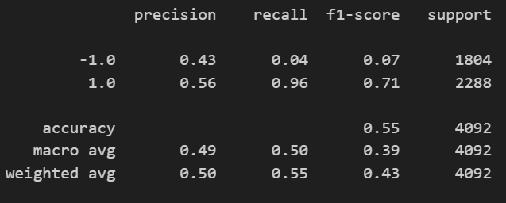
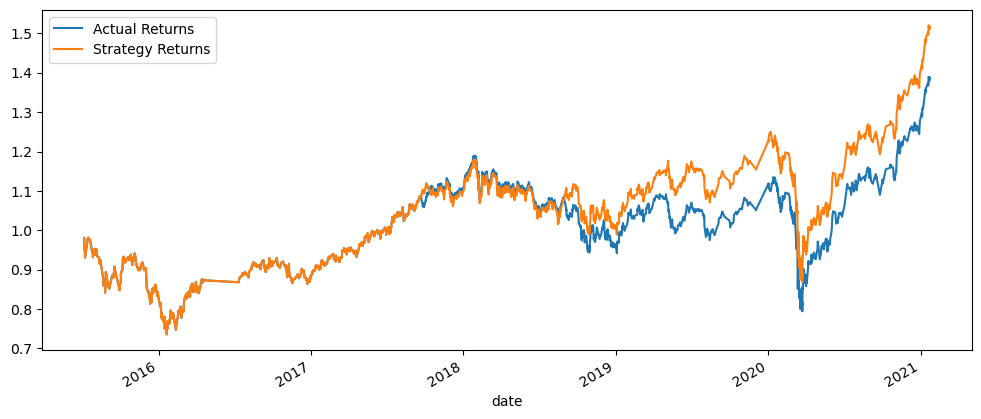
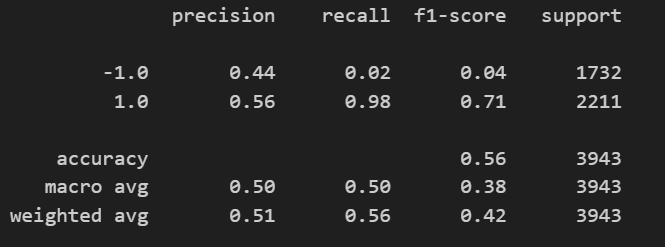
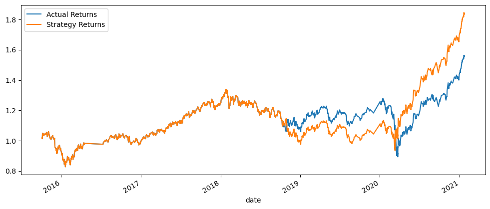
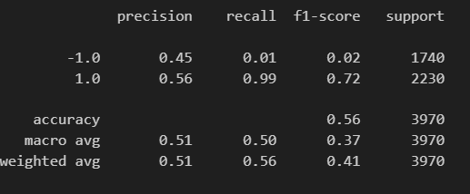
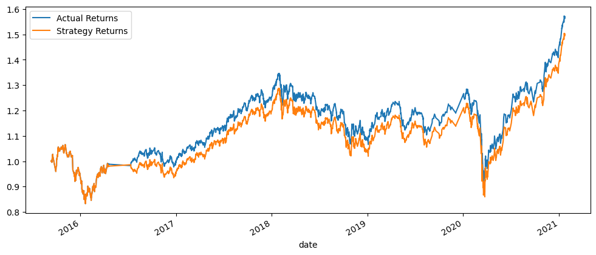
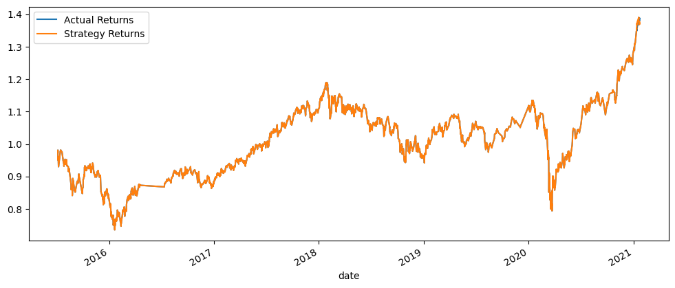

# Machine Learning Training Bot | Evaluation Report

## Contents

[Baseline Performance Algo](#Baseline-Performace-Trading-Algorithm)

[Tuned Baseline Trading Algo](#Tuned-baseline-Trading-Algo)

[Machine Learning Classifier Algo](#Multi-layer-Perceptron-Classifier-MLPC-Algo)

[Evaluation](#Final-Conclusions-and-Analysis)

----

### Baseline Performace Trading Algorithm

Using the SVM model, the classification report generated an accurcay score of 55%, with a recall score of 96% for buy and a recall score of 4% for sell.

The model predicts profitable buy opportunity due to its high recall score on 1.0 class. For cumulative return, nearing towards 2019 to 2021, strategy 

returns reported higher return in comparison to actual strategy.

### Tuned baseline Trading Algo

`Step 1: Tune the training algorithm by adjusting the size of the training dataset. `

`Answer the following question: What impact resulted from increasing or decreasing the training window?`

With the training window increased to 6 months, accuracy score increased by 1%, scoring 56%, buy signal increased by 2% scoring 98% and 

sell signal decreased by 2% scoring 2%. Between 2019 and 2020, strategy returns reported lower returns than actual returns whereas between 2020 and 2021, 

the strategy returns reported higher than the higher returns.

`Step 2: Tune the trading algorithm by adjusting the SMA input features.`

`Answer the following question: What impact resulted from increasing or decreasing either or both of the SMA windows?`

Adjusted the short window to 10 and decreased the long SMA window to 55, this maintained the accuracy score of 56%, scoring 99% recall on a class 1.0

for buy opportunity and  sell signal of 1% recall score. Strategy returns is almost close to the actual return meaning the model is gradually learning 

from the data and can be perfected in no time. 

#### Multi-layer Perceptron Classifer MLPC Algo

`Did this new model perform better or worse than the provided baseline model? `

MLP model performed better than the baseline performance algo for buy opportunities on class 1.0 with a recall score of 100%, accuracy  score of 56%, 

and a 0% recall score for sells which puts us in a position for the best entry possible.  

`Did this new model perform better or worse than your tuned trading algorithm?`

The tuned trading algorithm and the MLP Classifier model reported the same accuracy score of 56%, but MLP Classifier scored a 100% recall on a

class 1.0 for buy opportunity and a decrease for sell signal of 0 recall score.

#### Final Conclusions and Analysis

- Multi-Layer Perceptron Classifier(MLPC) trains using the backpropagation to learn revelant features while implementing Stochastic Gradient Descent(SGD)helped to correspond to the best fit between the actual and strategy returns, minimizing the loss function in the machine learning process. This helps to 
confidently predicted the buys, class of 1.0 other than the sells, class of -1.0. By comparison, it would be an expensive price to pay if the model is unable to predict the sell side or exit strategy for investor to the buys.

- MLPC accurately and perfectly predicted the buys class of 1.0 with a recall score of 100% as well as mimicking cumulative return plot perfectly indicating how well the model learned from the data.  
